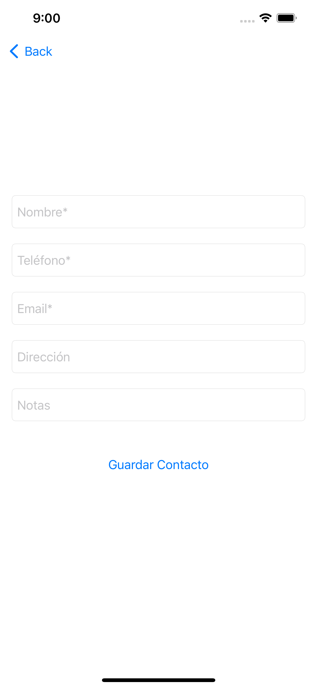
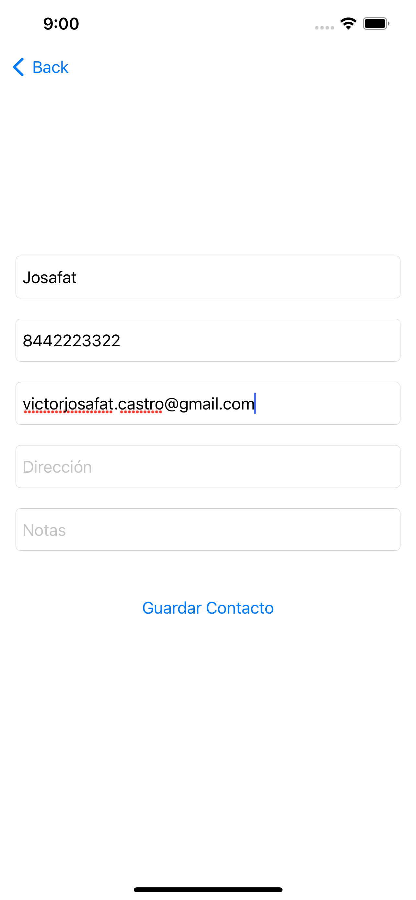
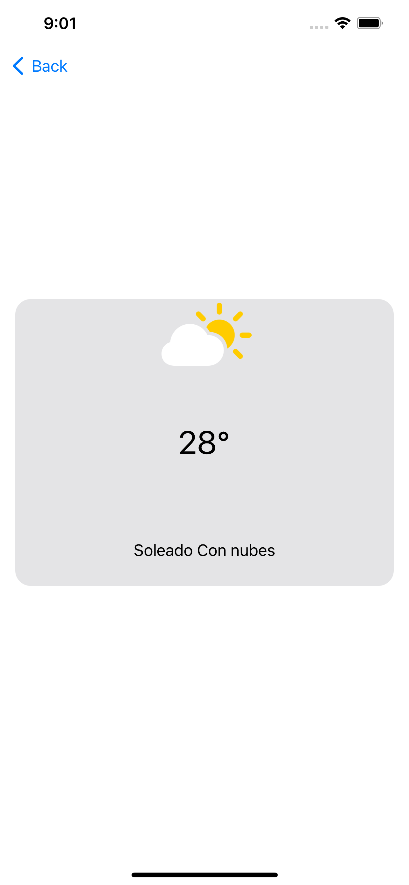

# Columbus Digital

## Evaluación técnica iOS

Ejercicio técnico: Software para registro de contactos.
Utilizando el lenguaje de tu preferencia y paradigma de programación, deberás realizar el siguiente ejercicio (swift / kotlin / java / objective C) preferentemente sobre iOS
Los entregables serán:
-El código fuente de la funcionalidad desarrollada. (GitHub son puntos extra)
-Screenshots de las pantallas desarrolladas (corriendo en simulador/emulador o dispositivo)
Instrucciones:
Desarrollar una aplicación (Agenda) la cual contendrá las siguientes secciones:

1. Menú principal
2. Agregar contacto
3. Lista de contactos
4. Información de contacto
5. Editar contacto

### Imagenes del Simulador







## Installation

OS X & Linux:

```sh
git clone JosafatCMtz/ContactRegistrationSoftware
```

## Usage example

### Development setup

For the part where the list of dogs is working, it is in `main`

```sh
git checkout main
```

To switch to try to save the data locally find it in `feature/save_data_locally`

```sh
git checkout feature/save_data_locally
```

### Release History

- 1.0.0
  - CREATE: First version where the list of ContactRegistrationSoftware
- 1.0.1
  - ADD: README.md

### Meta

Josafat Mtz – [@iamjosafatmtz](https://twitter.com/iamjosafatmtz) – victorjosafat.castro@gmail.com

[https://github.com/JosafatCMtz/github-link](https://github.com/JosafatCMtz/)

## Contributing

1. Fork it (<https://github.com/JosafatCMtz/ContactRegistrationSoftware/fork>)
2. Create your feature branch (`git checkout -b feature/fooBar`)
3. Commit your changes (`git commit -am 'Add some fooBar'`)
4. Push to the branch (`git push origin feature/fooBar`)
5. Create a new Pull Request
